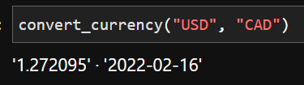
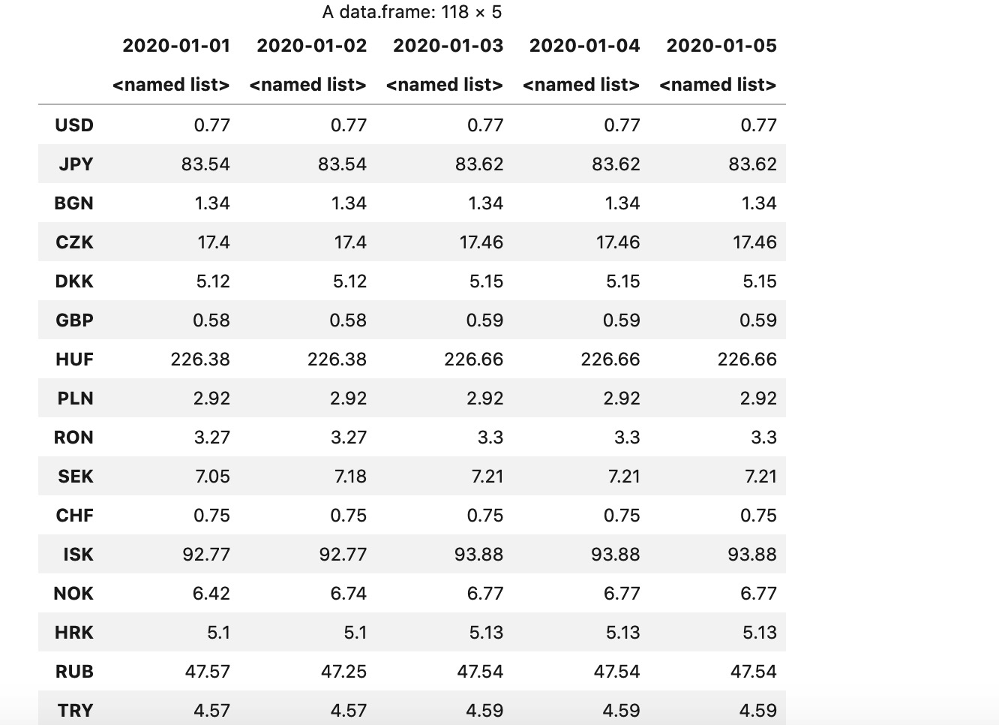
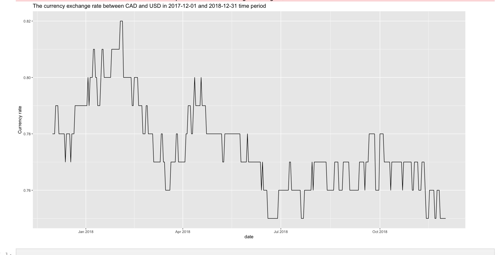
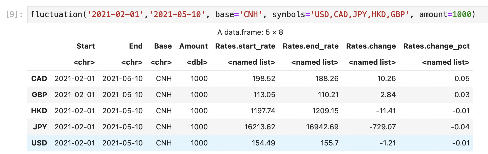

## currency_checker：wrapper to the exchangerate.host API


This is a package to interface with the exchangerate.host API. The exchangerate.host is an API that can get the currency exchange rate and the history trend of the currency. 

For more information about the API, you can visit the website: https://exchangerate.host/#/

# Function

## convert_currency

This function needs the user input the currency to convert from and the currency to convert to. It returns a list of length two containing the exchange rate and date. 

    ```R
    convert_currency("CAD", "USD")
    ```
    


## currency_time_series

This function need the user input the start date, end date and the base currency and return dataframe of the currency exchange rate during the time period. 

    ```R
    currency_time_series("2020-01-01","2020-01-05","CAD")
    ```
    

    

## history_trend_plot

This function need the user input the start date, end date, base currency and the aim currency and return the plot of the currency exchange rate between the 2 currency during the time period.

    ```R
    history_trend_plot("2017-12-01","2018-12-31","CAD","USD")
    ```
    
    


## latest rates

This function need the user input the base currency, aim currencies, and the amount and return dataframe of the latest foreign exchange reference rates of a list of currencies on a specific base at a specific amount on daily basis. 

    ```R
    latest_rates('CAD','USD,CNH,JPY,HKD,GBP',1000)
    ```
    
    


## fluctuation

This function need the user input the start date, the end date, the base currency, aim currencies, and the amount and return dataframe of the fluctuation information about a list of currencies on a specific base at a specific amount on a day-to-day basis. 

    ```R
    fluctuation('2021-02-01','2021-05-10', base='CNH', symbols='USD,CAD,JPY,HKD,GBP', amount=1000)
    ```
    
    

